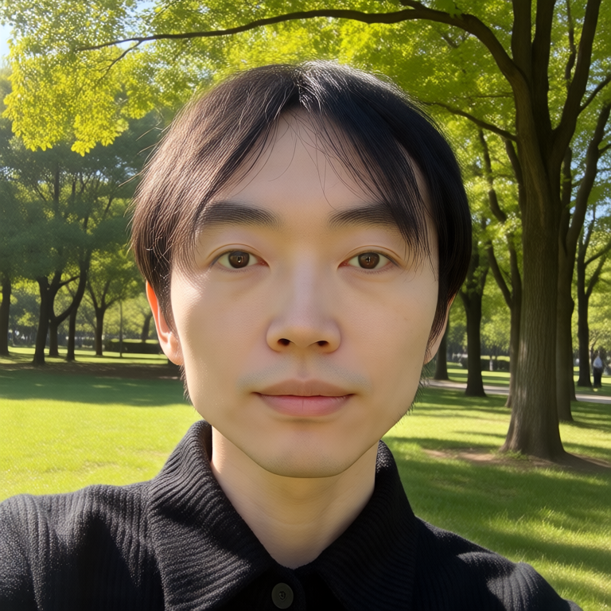
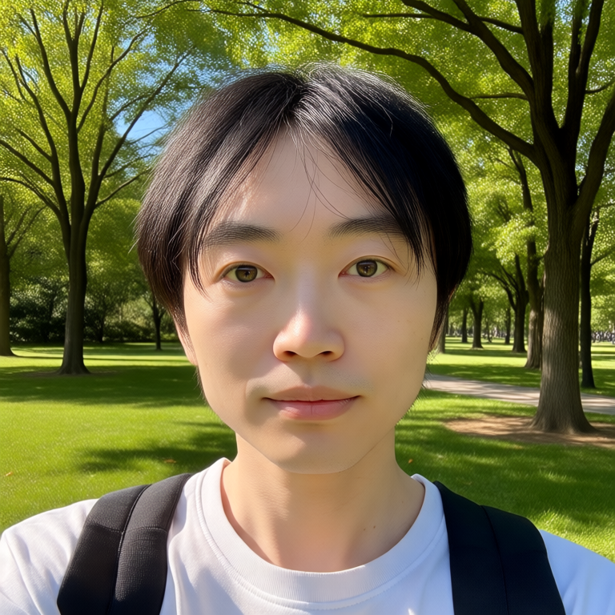
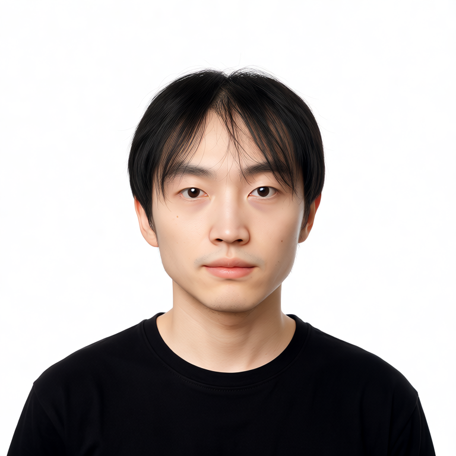
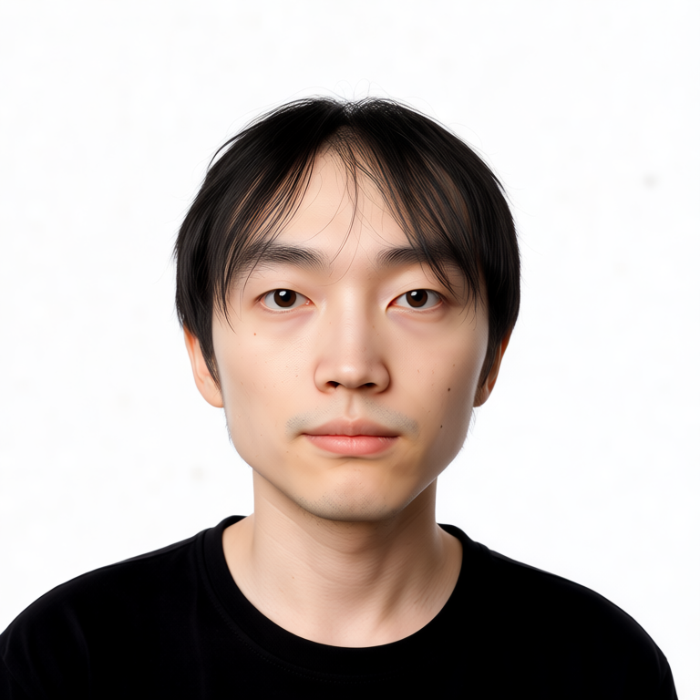
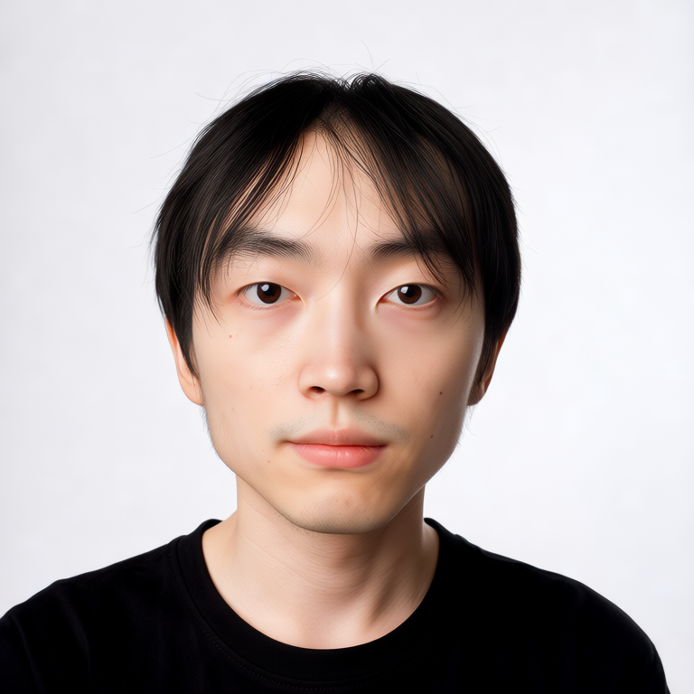

# Day 5 · 推理端集成（Identity Edit / Depth CN-LoRA）

Krea 2 没有 IP-Adapter。人像控制拆成两条，各配 myface LoRA（strength 0.85），同 seed=42：

- **路线 B**：Depth ControlNet-LoRA → 锁三维结构 / 取景
- **路线 A**：krea2edit Identity Edit → 按指令改图，同时从参考图抽外观

工作流：[`lora-training/workflows/day5_routeB_depth_controlnet.json`](../../lora-training/workflows/day5_routeB_depth_controlnet.json) · [`day5_routeA_krea2edit.json`](../../lora-training/workflows/day5_routeA_krea2edit.json)

正式对比图用控制图 `00027.jpg`（训练集内近景自拍）。InsightFace 数据：[benchmarks/2026-09-03-day5-insightface.md](../../lora-training/benchmarks/2026-09-03-day5-insightface.md)。

## 路线 B · Depth CN-LoRA（v3）

参考图近景正脸 + prompt「公园里看镜头的特写」。深度极性正确（近白远黑，invert 不用勾）。

| strength 1.0 | strength 0.6 |
|---|---|
|  |  |

- 1.0：头更近、有领口（跟着深度轮廓），身份 vs 00001 = **0.66**
- 0.6：拉远、白 T + 背包，更听 prompt，身份 **0.55**

**结论**：Depth 只锁剪影和取景，不锁衣服颜色、背景内容、身份。strength 推荐 **0.6–1.0**：要结构死跟着参考图用 1.0；要场景/服装听 prompt 用 0.6。

压力测试反例（v2）：同一张近景深度图 +「公园全身、侧拍、背对镜头」，strength 1.0 变成草地里一颗没有身子的后脑勺——Depth 把「脸那么大的洞」钉死，prompt 只能把内容塞进去。**不要让深度构图和 prompt 构图对着干。** 样张 `samples/b_v2_s1.0_conflict.png`。

参考图若也是证件照、prompt 也是证件照，0.6 vs 1.0 肉眼几乎没差（午间第一轮）。要比出 Depth，场景可以换，**朝向和景别要对齐**。

## 路线 A · Identity Edit（v2）

必须：`krea2_identity_edit_v1_2` @1.0 → 再叠 myface @0.85；prompt 用**编辑指令**，不是文生图 caption。

本轮指令：`keep this person's face and identity, change the background to a plain white studio backdrop, change the outfit to a black t-shirt`

| ref_boost 1.0 | 4.0（官方推荐） | 8.0 |
|---|---|---|
|  |  |  |

三档都完成了白底 + 黑 T，木门/卡其衬衫没有被拷回来。身份 vs 00001：0.68 → 0.69 → **0.73**（单调升，高于 Day 4 纯 LoRA 扫描上限 0.67）；vs 控制图 00027：0.69 → 0.73 → **0.76**。

**结论**：ref_boost 拉的是「多像这张参考脸」，不是「多拷原图场景」。产品档用 **4.0**；要更像这张自拍可到 8.0。官方说 >10 改图指令会开始失败，本轮没测。

第一轮 A 糊成蜡像、额头棋盘格：工作流只挂了 myface，**没挂 identity_edit LoRA**，还把文生图 prompt 喂给编辑节点。那三张作废。

## 组件边界表

| 组件 | 负责 | 不负责 |
|---|---|---|
| **myface LoRA** | 身份（是不是这个人） | 构图、场景、姿态、服装 |
| **Depth CN-LoRA** | 三维结构 / 头肩剪影 / 取景远近 | 衣服颜色、背景内容、五官身份 |
| **krea2edit + identity_edit LoRA** | 按自然语言改图，并从参考图抽脸/外观 | 不能当 IP-Adapter；不挂专用 LoRA 会涂抹成伪人 |
| **prompt** | 场景、服装、风格、是否看镜头 | 单独保不住身份 |
| **IP-Adapter** | 无 Krea 2 方案（IPAdapter Plus 仅 SD1.5/SDXL/Flux） | — |

人像取舍：要保姿态用 OpenPose（权重源未核，本轮没跑）；要保三维结构/景别用 Depth；要改衣服或背景并保住这张脸用 Identity Edit。三条不要抢同一件事。

推荐组合（本轮可复现）：

- 换场景、脸还在：Depth **0.6–1.0** + myface 0.85 + **看镜头的场景 prompt**
- 换装/换背景、脸更贴某张自拍：identity_edit 1.0 + myface 0.85 + 编辑指令 + ref_boost **4.0**
- 不要：Identity Edit 不挂专用 LoRA；Depth 1.0 去对抗完全相反的景别

A+B+myface 三重叠加未测（stretch）。`Week1/Day5/queue_day5.py` 仍是第一轮 API 草稿，参数已过时，不要直接跑。

## 底模

Depth CN 与 Identity Edit 都挂 **Krea 2 RAW FP8**（与 Day 3/4 同链）。Week 1 推理全程 FP8，未跑 Turbo / NVFP4。
