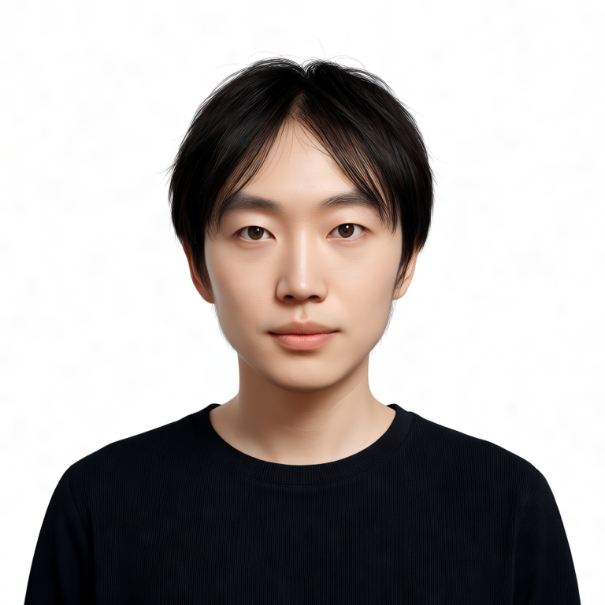

# Krea 2 LoRA 训练

第 1 周核心项目：完整跑通 Krea 2 LoRA 训练，产出 1 个可用 LoRA、训练配置、效果评估和调参记录。**已完成（Day 3）**，完整记录见 [Week1/Day3 训练报告](../Week1/Day3/training_report.md)。

## 核心功能

- Musubi Tuner v0.3.4 训练 Krea 2 人物 LoRA（768px、BF16 基座运行时转 FP8、cached latents + text encoder outputs）
- 自然语言 caption 打标（Qwen3-VL，不用 WD14 tag）
- 6 场景 × 4 checkpoint（step300/600/900/1200）横评，给出分场景最佳参数
- **InsightFace 量化评估**：权重扫描 0.5–1.2 相似度单调上升（0.41→0.67），无 LoRA 基线仅 0.05
- **触发词泄漏验证**：2×2 矩阵量化确认——无触发词相似度 0.57 vs 无 LoRA 基线 0.05（社区已知 Krea 2 缺陷）
- **推理端集成（Day 5）**：路线 B Depth CN-LoRA（strength 0.6/1.0）+ 路线 A krea2edit Identity Edit（ref_boost 1.0/4.0/8.0）；IP-Adapter 无 Krea 2 方案已留证。报告：[Week1/Day5/README.md](../Week1/Day5/README.md)

## 效果展示

无 LoRA vs 有 LoRA（同 seed=42、同 prompt、step900 checkpoint、strength 0.85）——仅添加 LoRA，人物从随机中年女性变为目标人物，身份还原成功：

| 无 LoRA | 有 LoRA |
|---|---|
|  |  |

最佳配置：**step1200 checkpoint + strength 0.85**（微笑/艺术感场景 step600 更好）。完整横评见训练报告 §5，更多样张见 `../Week1/Day3/samples/`（front / side / smile / outdoor / fullbody / artistic 六个场景）。

量化评估与缺陷验证（Day 4）：[InsightFace 相似度数据](./benchmarks/2026-09-03-insightface-similarity.md) · [触发词泄漏 2×2 矩阵](../Week1/Day3/training_report.md#55-触发词泄漏系统验证day-4-补测)。

推理端集成（Day 5）：Depth 锁取景、Identity Edit 按指令换装换背景，身份仍由 myface 托底。公园近景 strength 1.0 vs 0.6：

| Depth 1.0 | Depth 0.6 |
|---|---|
|  |  |

Identity Edit 白底黑 T（ref_boost 4.0 为官方推荐档）：

| 1.0 | 4.0 | 8.0 |
|---|---|---|
|  |  |  |

InsightFace：A 对 00001 达 0.68–0.73（超过 Day 4 纯 LoRA 上限 0.67）；B strength 1.0 = 0.66 / 0.6 = 0.55。[数据](./benchmarks/2026-09-03-day5-insightface.md) · [组件边界表](../Week1/Day5/README.md#组件边界表)

## 技术栈

- 训练：Musubi Tuner v0.3.4（恒源云 RTX 4090D 24GB 云训练；本地 AI-Toolkit 路线未用于最终训练，尝试配置保留在 `config/`）
- 推理：ComfyUI + Krea 2 RAW FP8（工作流：[krea2_raw_lora_test.json](../krea2_raw_lora_test.json)）
- 打标：自然语言 caption

## 安装 / 使用

- 实际训练配置：[Week1/Day3/training/](../Week1/Day3/training/)（dataset.toml + 训练命令，按训练报告参数重建，云端原始文件未保存）
- 本地 AI-Toolkit 尝试配置：`config/krea2_ohwx_person.yml`（未用于最终训练）
- 权重文件不入库（见根目录 `.gitignore`）

## 性能 / 成本

- 首次实测：RTX 4090D 24GB，1200 步 / 48 分钟（约 2.4 秒/步），峰值显存约 18–20GB
- 云端费用：AutoDL **2.18 元/h × 48 min = 1.74 元**（[明细](./benchmarks/2026-09-03-training-cost.md)）
- 环境基线：[benchmarks/2026-09-01-environment.md](./benchmarks/2026-09-01-environment.md)
